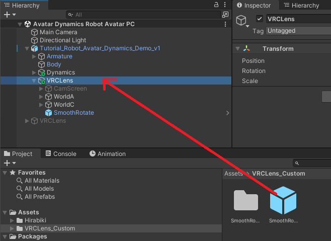

# VRCLens Customizations

VRCLens mods/customizations with non-destructive prefabs

## Requirements

- [VRCFury](https://vrcfury.com/download)

## SmoothRotate

Adds a slider that smooths out your camera rotation (including drone hand-rotate). 0% is the minimum (default) smoothing, and 100% is the maximum amount of smoothing.

Applies when using the camera in white/yellow Stabilize mode, or when using the Drone Hand-Rotate mode.

Last tested: VRCLens 1.9.2

<video src="https://github.com/user-attachments/assets/05d5c2fd-28e6-4f38-8b98-11be5db84a1b"></video>

### Installation

1. Install VRCFury in your project.
2. Import the `VRCLens_Custom` Unity package.
3. Drag the `VRCLens_Custom/SmoothRotate` prefab onto the `VRCLens` object on your avatar.

    

4. Upload your avatar. The slider will be in your menu under `VRCLens/Custom/SmoothRotate`. To remove the mod, just delete the prefab.

### Credits

Thanks to [Minkis](https://www.youtube.com/watch?v=XMcTfFoNUHA) for explaining how to do this.
