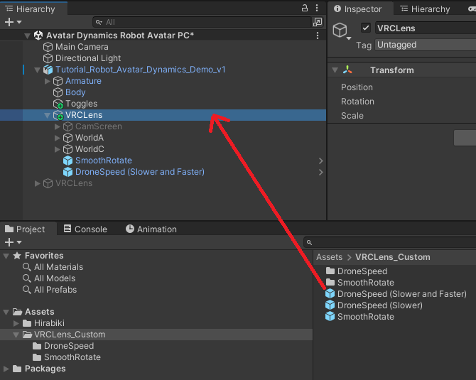

# VRCLens Customizations

VRCLens mods/customizations with non-destructive prefabs

[**Download the latest version**](https://github.com/gummidot/VRCLens_Custom/releases/tag/v1.1.0)

## Requirements

- [VRCFury](https://vrcfury.com/download)

## SmoothRotate

Adds a slider that smooths out your camera rotation (including drone hand-rotate). 0% is the minimum (default) smoothing, and 100% is the maximum amount of smoothing.

Applies when using the camera in white/yellow Stabilize mode, or when using the Drone Hand-Rotate mode.

Last tested: VRCLens 1.9.2

<video src="https://github.com/user-attachments/assets/05d5c2fd-28e6-4f38-8b98-11be5db84a1b"></video>

### Installation

1. Install VRCFury in your project.
2. Import the `VRCLens_Custom` Unity package.
3. Drag the `VRCLens_Custom/SmoothRotate` prefab onto the `VRCLens` object on your avatar.

   

4. Upload your avatar. The slider will be in your menu under `VRCLens/Custom/SmoothRotate`. To remove the mod, just delete the prefab.

### Credits

Thanks to [Minkis](https://www.youtube.com/watch?v=XMcTfFoNUHA) for explaining how to do this.

## DroneSpeed

Modifies the Drone Speed slider. There are two versions:

- **Slower** allows the drone to move much slower
- **Slower and Faster** allows the drone to move much slower and much faster

For both, the default speed (25%) is still the same as before. However, 0% speed is now zero speed.

For **Slower and Faster**, 100% speed is now 32x the original max speed, and 75% speed is now the original max speed.

Last tested: VRCLens 1.9.2

<video src="https://github.com/user-attachments/assets/672eee73-1523-4737-9267-767bda7d8efb"></video>

### Installation

1. Install VRCFury in your project.
2. Import the `VRCLens_Custom` Unity package.
3. Drag **one** of the `VRCLens_Custom/DroneSpeed` prefabs onto the `VRCLens` object on your avatar.

   

4. Upload your avatar. Use the built-in Drone Speed slider as usual. To remove the mod, just delete the prefab.
