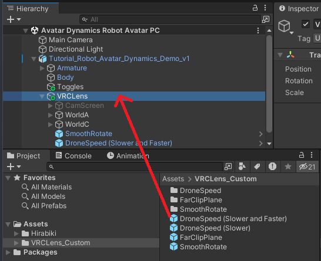
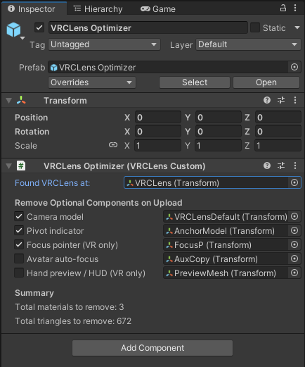

# VRCLens Mods

VRCLens mods with drag-n-drop VRCFury prefabs

[**Download the latest version**](https://github.com/gummidot/VRCLens-Mods/releases/tag/v1.4.0)

## Requirements

- [VRCFury](https://vrcfury.com/download)

## Installation

Each mod is a VRCFury prefab that you drag-n-drop onto your avatar to install.
You can pick which ones to install, then easily remove them by deleting the prefab.
All mods are local-only or take no extra parameter memory.

1. Import the `VRCLens_Custom` Unity package and find the `Assets/VRCLens_Custom` folder.
1. Drag any of the prefabs onto the `VRCLens` object on your avatar.
   - **Note:** If you re-apply VRCLens, the prefabs will disappear, so you will have to do this again.

> [!WARNING]
> Mods have only been tested with the versions of VRCLens listed below. They could be broken in very old versions, but should work in most recent versions.

## Mods

- [SmoothRotate](#smoothrotate) - Adds a slider that smooths out camera movement
- [DroneSpeed](#dronespeed) - Modifies the Drone Speed slider to go slower or faster than default
- [FarClipPlane](#farclipplane) - Increases the camera's far clipping plane
- [MaxBlurSize](#maxblursize) - Adjusts the maximum blur size for performance
- [MoveDroneVertical](#movedronevertical) - Adds a puppet menu to move the drone vertically
- [VRCLensOptimizer](#vrclensoptimizer) - Removes optional components from VRCLens (materials, poly count)

## SmoothRotate

**Adds a slider that smooths out camera movement**

Works in both desktop and VR, and can smooth much more than OVR-SmoothTracking.

Last tested: VRCLens 1.9.2

### Usage

The slider will be in your menu under `VRCLens/Custom/SmoothRotate`.
0% is the minimum (default) smoothing, and 100% is the maximum amount of smoothing.

Make sure Stabilize mode is on (the white/yellow hand icon) for this to work.

<video src="https://github.com/user-attachments/assets/05d5c2fd-28e6-4f38-8b98-11be5db84a1b"></video>

### Credits

Thanks to [Minkis](https://www.youtube.com/watch?v=XMcTfFoNUHA) for explaining how to do this.

## DroneSpeed

**Modifies the Drone Speed slider to go slower or faster than default**

There are two versions, only add one to your avatar:

- **Slower** allows the drone to move much slower. 0% is now zero speed.
- **Slower and Faster** allows the drone to move much slower and much faster. 0% is now zero speed, 75% is the original max speed, and 100% is 32x the original max speed.

Last tested: VRCLens 1.9.2

### Usage

Use the built-in Drone Speed slider as usual.

<video src="https://github.com/user-attachments/assets/672eee73-1523-4737-9267-767bda7d8efb"></video>

## FarClipPlane

**Increases the camera's far clipping plane**

In some worlds, far objects disappear in VRCLens because of its short far clip plane of `32000`.
This adds a local-only slider that increases the far clipping plane up to `128000`.

Last tested: VRCLens 1.9.2

### Usage

The slider will be in your menu under `VRCLens/Custom/FarClipPlane`.

<video src="https://github.com/user-attachments/assets/bb43007a-006c-4075-aa23-1c9b4624e407"></video>

Test worlds: [Tulip Riverie․․․](https://vrchat.com/home/world/wrld_fcad2657-05c6-4226-ac5d-9cd1688beb74/info), [Cycle of Life](https://vrchat.com/home/world/wrld_cd085851-4baf-4fb8-9a2a-e0e20f686502/info)

## MaxBlurSize

**Adjusts the maximum blur size for performance**

Adds a local-only slider that lets you adjust the maximum blur size when using DoF, which you can use to improve performance (lower blur size = better performance) or change how the blurring looks.

Last tested: VRCLens 1.9.2

### Usage

The slider will be in your menu under `VRCLens/Custom/MaxBlurSize`.

At 0%, the slider has no effect so it uses whatever blur size you installed VRCLens with. After 0%, the slider increases blur size from `Very Small` up until `Very Large` (see VRCLens installer for the different options).

<video src="https://github.com/user-attachments/assets/d929ee5a-3fec-4bab-8f0e-3e6255932236"></video>

## MoveDroneVertical

**Adds a puppet menu to move the drone vertically**

The usual way to move the drone vertically is to use gestures to switch between forward/back and up/down movement. With a separate puppet menu, you can move the drone vertically more easily, and also move both forward/back and up/down at the same time.

Last tested: VRCLens 1.9.2

### Usage

The puppet menu will be in your menu under `VRCLens/Custom/Move Drone Vertical`.

<video src="https://github.com/user-attachments/assets/172956c2-84d5-4f11-9ad8-f93599b73564"></video>

## VRCLensOptimizer

**Removes optional components from VRCLens (materials, poly count)**

Remove up to 5 optional components on VRCLens for performance optimization:

- **Default camera model** (1 material, 466 tris)
   - Can be removed since it's just cosmetic.
- **Pivot indicator** (1 material, 194 tris)
   - Can be removed if you don't use the pivot feature.
- **Focus pointer for VR only** (1 material, 12 tris)
   - The blue pointer on your off-hand finger that lets you move focus in VR.
- **Avatar auto-focus** (1 material, 12 tris)
   - Can be removed if you don't use avatar AF.
- **Hand preview / HUD for VR only** (1 material, 4 tris)
   - Can be removed if you always use an external desktop overlay. You won't be able to see camera settings like zoom level anymore though.

### Usage

Drag and drop the `VRCLensOptimizer` prefab onto the `VRCLens` object on your avatar. Check the components you want to remove. Components are removed on upload, so check your avatar stats in game for the actual material/poly count.

## Other Mods

Related VRCLens mods that aren't included in the package.

### VRCLens as a VRCFury Prefab

VRCLens directly modifies your avatar’s FX controller, menu, and parameters, making it hard to share or have different versions of your avatar with/without VRCLens.

If you convert VRCLens to a VRCFury prefab, VRCLens can be set up once, then drag-n-drop'd to different avatar versions, and then be easily deleted.

This is a manual process - see guide at https://gummidot.notion.site/VRCLens-as-a-VRCFury-Prefab-15623187a377802fbc17d0357e56f8bc
