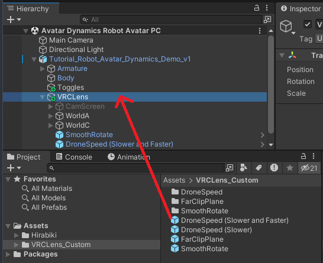
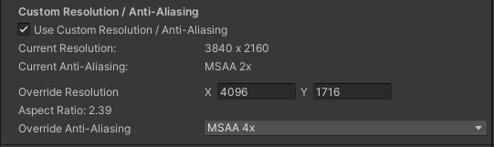
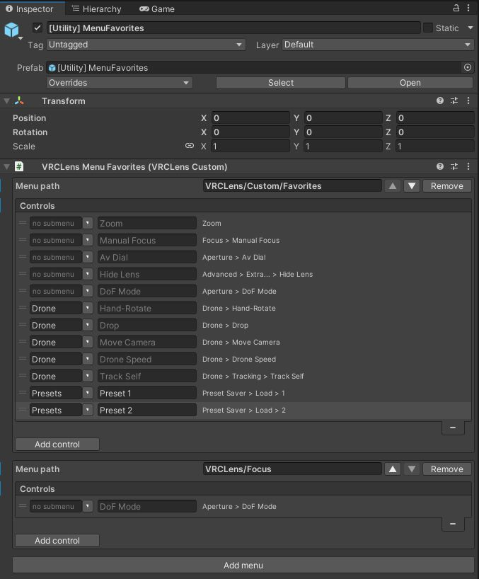
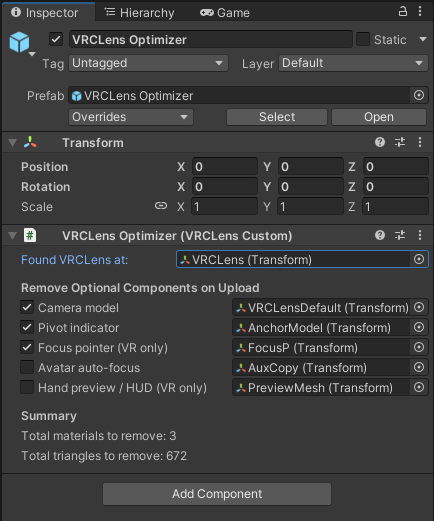

# VRCLens Add-ons

Camera filters and quality-of-life add-ons for [VRCLens by Hirabiki](https://hirabiki.gumroad.com/l/rpnel).

[**Download the latest version**](https://github.com/gummidot/VRCLens-Addons/releases/latest) | [日本語はこちら (Japanese)](README_JP.md)

Hashtag / ハッシュタグ: #GhostLens #VRCLens

> [!NOTE]
> **Upgrading from v1.x?** The folder structure has changed in v2.0. Delete the entire `Assets/VRCLens_Custom` folder and re-import the new package. Then re-drag any prefabs onto your avatar.

## Installation

Each add-on is a VRCFury prefab that you drag-and-drop onto an existing VRCLens installation. Pick which ones you want, add or remove them any time, all without modifying VRCLens. All add-ons are local-only or take no extra parameter memory.

1. Install [VRCLens](https://hirabiki.gumroad.com/l/rpnel) on your avatar first.
1. Make sure you have [VRCFury](https://vrcfury.com/download) installed.
1. Import the `VRCLens_Custom` Unity package and find the `Assets/VRCLens_Custom` folder.
1. Drag any of the prefabs onto the `VRCLens` object on your avatar.
   - **Note:** If you re-apply VRCLens, the prefabs will disappear, so you will have to do this again.



## Supported VRCLens Versions

> [!WARNING]
> These are unofficial add-ons to VRCLens and may break when VRCLens updates. Older or newer versions may not work.

- **VRCLens 1.10.0**
- **VRCLens 1.9.2**

## Add-ons

**Filters**

| Prefab | Description |
|--------|-------------|
| [Ghost Lens](#ghost-lens) | Ghosting/motion blur filter inspired by Prism Lens FX filters *(paid, [Booth](https://gummidot.booth.pm/items/8375173))* |
| [Fisheye Lens](#fisheye-lens) | Fisheye lens distortion |
| [Chromatic Aberration](#chromatic-aberration) | Color fringing effect |
| [Color Grading](#color-grading) | Shadow/midtone/highlight color adjustments with brightness |
| [Film Grain](#film-grain) | Film grain overlay effect |
| [Vignette](#vignette) | Vignette darkening around edges |
| [Letterbox](#letterbox) | Letterbox/pillarbox aspect ratio presets |
| [Depth Fog](#depth-fog) | Atmospheric fog based on scene depth |
| [Tilt-Shift](#tilt-shift) | Tilt-shift miniature depth-of-field |
| [Pixelation](#pixelation) | Retro pixelation effect |
| [Swirly Bokeh](#swirly-bokeh) | Swirly bokeh effect |
| [Anamorphic Bokeh](#anamorphic-bokeh) | Oval-shaped anamorphic bokeh |
| [Zoom Blur](#zoom-blur) | Zoom blur effect |
<!-- | [Soft Glow](#soft-glow) | Diffusion glow filter | -->

**Camera**

| Prefab | Description |
|--------|-------------|
| [Smooth Rotate](#smooth-rotate) | Smooths out camera movement |
| [Smooth Zoom](#smooth-zoom) | Adds slight smoothing to the Zoom slider |
| [Custom Resolution](#custom-resolution) | Overrides camera resolution and anti-aliasing |
| [Far Clip Plane](#far-clip-plane) | Increases the camera's far clipping plane |
| [Player Visibility](#player-visibility) | Hide remote players or yourself from VRCLens |
| [Smooth DoF Edges](#smooth-dof-edges) | Smooths the sharp edges between subjects and blurred backgrounds |

**Drone**

| Prefab | Description |
|--------|-------------|
| [Drone Speed](#drone-speed) | Drone Speed slider goes slower or faster than default |
| [Move Drone Vertical](#move-drone-vertical) | Puppet menu to move the drone vertically |
| [Avatar Offset](#avatar-offset) | Offsets the camera from your avatar while keeping hand control |
| [Camera Pins & Dolly](#camera-pins--dolly) | Drop camera pins, then teleport or dolly between them |

**Focus**

| Prefab | Description |
|--------|-------------|
| [Manual Focus (9m)](#manual-focus-9m) | Limits the Manual Focus slider to 9m |
| [Manual Focus (0.1m to 9m)](#manual-focus-01m-to-9m) | Allows Manual Focus down to 0.1m |
| [Manual Focus Assist](#manual-focus-assist) | Reduces blur on avatars near your focus point |
| [Max Blur Size](#max-blur-size) | Adjusts the maximum blur size for performance |

**Utility**

| Prefab | Description |
|--------|-------------|
| [Preset Saver](#preset-saver) | Save up to 6 presets for your custom add-on settings |
| [Menu Favorites](#menu-favorites) | Build custom VRCLens menus with your favorite controls |
| [VRCLens Optimizer](#vrclens-optimizer) | Removes optional VRCLens components |
| [Fix Avatar Drop](#fix-avatar-drop) | Fixes Avatar Drop broken in VRCLens 1.9.1+ |

---

## Filters

### Ghost Lens

> [!NOTE]
> Ghost Lens is a paid add-on, available on [Booth](https://gummidot.booth.pm/items/8375173). All other add-ons are free.

**Ghosting/motion blur filter inspired by [Prism Lens FX](https://prismlensfx.com/) filters**

Recreates the ghosting/motion blur effect of the physical filter, producing semi-transparent shifted copies of your image. Split mode creates a single directional ghost on half the frame. Dual mode creates double ghosting from both sides, leaving your center-framed subject unaffected. Fully rotatable.

#### Usage

The controls will be in your menu under `VRCLens/Custom/Ghost Lens` with submenus for Ghost Mode, Blend Mode, Focus Zone, Effects, and Advanced.

<video src="https://github.com/user-attachments/assets/0f83f620-a3e5-4e0f-a0ef-57fcc2505714"></video>

| Setting | Range | Default | Description |
|---|---|---|---|
| Enable | On / Off | Off | Enable ghost effect. |

Ghost Mode submenu:

| Setting | Range | Default | Description |
|---|---|---|---|
| Split Ghost | On / Off | Off | Half-image single ghost mode. |
| Dual Ghost | On / Off | Off | Center-clear double ghost mode. |
| Full Screen | On / Off | Off | Bypass zone mask, ghost the entire frame. |
| Center Width (Dual) | 0% - 100% | 25% | Clear center zone width for Dual mode. |

Main controls:

| Setting | Range | Default | Description |
|---|---|---|---|
| Rotation | 0% - 100% | 50% | Ghost direction (maps to 0-360 degrees). |
| Distance | 0% - 100% | 33% | How far the ghost is shifted from the original. |
| Intensity | 0% - 100% | 50% | How visible the ghost is. |
| Smear | 0% - 100% | 25% | Directional streak/blur amount. |

Blend Mode submenu (mutually exclusive toggles):

| Setting | Default | Description |
|---|---|---|
| Lighten | On | Only shows the ghost where it's brighter than the original. Closest to a real prism filter. |
| Normal | Off | Standard blend. Ghost overlays everywhere regardless of brightness. |
| Screen | Off | Brightens without blowing out highlights. Softer than Additive, good for dreamy glows. |
| Additive | Off | Adds ghost light on top. Can blow out highlights. Intense light leak look. |
| Darken | Off | Only shows the ghost where it's darker than the original. Moody shadow-like ghosts. |

Focus Zone submenu:

| Setting | Range | Default | Description |
|---|---|---|---|
| Enable | On / Off | Off | Ghost only near the focus point (ghost on subject). DoF does not need to be enabled; just set VRCLens manual focus. |
| Spread | 0% - 100% | 40% | How far from the focus point the effect extends. Low = tight zone, high = wider zone. |
| Reverse | On / Off | Off | Reverse: ghost on everything except the focused subject. |
| Focus Distance | 0% - 100% | 0% | Convenience duplicate of VRCLens's Manual Focus slider. Saves navigating back to the Focus menu. |

Effects submenu:

| Setting | Range | Default | Description |
|---|---|---|---|
| Shake | | | Handheld camera shake submenu. |
| Shimmer | 0% - 100% | 0% | Randomized drift over time. |
| Chroma | 0% - 100% | 0% | Chromatic color split on ghost reflections. Unlike [Chromatic Aberration](#chromatic-aberration), this only affects the ghost itself. |
| Color | | | Primary ghost color submenu. |
| Dual Color | | | Second ghost color submenu for Dual mode. |

Color submenu:

| Setting | Range | Default | Description |
|---|---|---|---|
| R / G / B | 0% - 100% | 50% | Individual color adjustment. 50% = neutral. |

Dual Color submenu:

| Setting | Range | Default | Description |
|---|---|---|---|
| Enable | On / Off | Off | Use a separate color for the second ghost in Dual mode. |
| R / G / B | 0% - 100% | 50% | Individual color adjustment. 50% = neutral. |

Shake submenu:

| Setting | Range | Default | Description |
|---|---|---|---|
| Intensity | 0% - 100% | 0% | Handheld shake intensity. |
| Speed | 0% - 100% | 30% | Shake animation speed. |
| Distance | 0% - 100% | 0% | How far shake moves the ghost. |

Advanced submenu:

| Setting | Range | Default | Description |
|---|---|---|---|
| Smear Width | 0% - 100% | 25% | Directional streak width. |
| Layers | 0% - 100% | 0% | Trail distance multiplier (1-5 layers). |
| Edge Smoothing | 0% - 100% | 30% | Fades the ghost effect near the screen edges to prevent edge streaking. Higher = cleaner edges, more muted ghost. |

> [!NOTE]
> Ghost Lens is more GPU-intensive than other filter mods. You may notice lower FPS while it is active, especially at high smear or layer values.

### Fisheye Lens

**Fisheye lens distortion**

Fisheye lens distortion that bulges the center outward with increasing curvature toward the edges. Includes oval crop, edge softness, and a reverse (pincushion) mode.

> [!NOTE]
> This is a post-process filter that remaps existing pixels on screen. For a more realistic fisheye effect, consider [Flex FishEye Lens](https://goat-cannery.booth.pm/items/5512392).

#### Usage

The controls will be in your menu under `VRCLens/Custom/Fisheye Lens`.

<video src="https://github.com/user-attachments/assets/86af8b33-2abd-486b-bcd8-9e591daf1eb7"></video>

| Setting | Range | Default | Description |
|---|---|---|---|
| Enable | On / Off | Off | Enable or disable the effect. |
| Strength | 0% - 100% | 12% | Fisheye distortion amount. |
| Roundness | 0% - 100% | 0% | 0% = screen-filling oval, 100% = true circle. |
| Lens Size | 0% - 100% | 65% | Oval crop size. Higher hides the crop entirely (full warped rectangle visible at 100%). |
| Edge Softness | 0% - 100% | 0% | How gradually the edges fade to black. 0% = hard cutoff. |
| Reverse Fisheye | 0% - 100% | 0% | Reverse fisheye distortion. Overrides Strength when active. |
| Center X | 0% - 100% | 50% | Moves the distortion center left/right. |
| Center Y | 0% - 100% | 50% | Moves the distortion center up/down. |

### Chromatic Aberration

**Chromatic aberration (color fringing) effect**

Transverse CA creates radial color fringing that increases toward screen edges. Axial CA creates depth-dependent color fringing on out-of-focus areas. Both can be active simultaneously.

#### Usage

The sliders will be in your menu under `VRCLens/Custom/Chromatic Aberration`.

<video src="https://github.com/user-attachments/assets/018d75ee-fefd-4c83-a3c3-8f048995cdd9"></video>

| Setting | Range | Default | Description |
|---|---|---|---|
| Enable | On / Off | Off | Enable or disable the effect. |
| Transverse CA | 0% - 100% | 10% | Color fringing toward screen edges. |
| Axial CA | 0% - 100% | 0% | Color fringing on out-of-focus areas. |

Axial Focus-Aware submenu:

| Setting | Range | Default | Description |
|---|---|---|---|
| Enabled | On / Off | On | Reduces axial CA in the focus zone so sharp subjects stay clean. |
| Magenta-Green | On / Off | Off | Switch between red/blue fringing and magenta/green fringing. |

### Color Grading

**Shadow/midtone/highlight color grading with brightness, saturation, vibrance, and contrast**

Global saturation, vibrance, and contrast. Plus per-zone brightness, temperature, and RGB shifts for shadows, midtones, and highlights.

#### Usage

The controls will be in your menu under `VRCLens/Custom/Color Grading` with submenus for each zone.

<video src="https://github.com/user-attachments/assets/5fd955e0-21af-4cb9-97e0-a28246fb1d1c"></video>

| Setting | Range | Default | Description |
|---|---|---|---|
| Enable | On / Off | Off | Enable or disable the effect. |
| Saturation | 0% - 100% | 50% | Color intensity. 50% = no change, 0% = desaturated, 100% = oversaturated. |
| Vibrance | 0% - 100% | 0% | Boosts muted colors without oversaturating skin tones. |
| Contrast | 0% - 100% | 50% | 50% = no change, 0% = low contrast, 100% = high contrast. |

Per-zone controls (Shadows, Midtones, Highlights submenus):

| Setting | Range | Default | Description |
|---|---|---|---|
| Brightness | 0% - 100% | 50% | 50% = no change, 0% = darker, 100% = brighter. |
| Temperature | 0% - 100% | 50% | 0% = cool/blue, 50% = neutral, 100% = warm/orange. |
| R / G / B | 0% - 100% | 50% | Individual color adjustment. 50% = neutral. |

| Setting | Description |
|---|---|
| Reset | Resets all color grading parameters to defaults. |

### Film Grain

**Analog film grain overlay**

Moving film grain that blends dynamically with lighting, with heavier texture toward the edges.

#### Usage

The controls will be in your menu under `VRCLens/Custom/Film Grain`.

<video src="https://github.com/user-attachments/assets/9cc01bf0-5067-40e7-a414-5d75af831021"></video>

| Setting | Range | Default | Description |
|---|---|---|---|
| Enable | On / Off | Off | Enable or disable the effect. |
| Intensity | 0% - 100% | 25% | Grain amount. 0% = off. |
| Size | 0% - 100% | 0% | Grain particle size. 0% = fine (~1.5px), 100% = coarse (~4px). |
| Brightness | 0% - 100% | 50% | Grain brightness bias. Below 50% darkens, above 50% brightens. |
| Speed | 0% - 100% | 50% | Animation speed. 0% = frozen, 100% = fast. |

### Vignette

**Vignette effect with adjustable shape and softness**

Darkens screen edges toward black while keeping the center bright. Shape can morph from an oval (following screen aspect) to a true circle.

#### Usage

The controls will be in your menu under `VRCLens/Custom/Vignette`.

<video src="https://github.com/user-attachments/assets/b1297efe-c6c0-4737-8509-7bc3541ad93d"></video>

| Setting | Range | Default | Description |
|---|---|---|---|
| Enable | On / Off | Off | Enable or disable the effect. |
| Strength | 0% - 100% | 25% | Darkening intensity at edges. |
| Radius | 0% - 100% | 80% | How far from center before darkening starts. |
| Softness | 0% - 100% | 50% | How gradual the fade is. Low = sharp edge, high = smooth fade. |
| Roundness | 0% - 100% | 0% | 0% = oval, 100% = circle. |

### Letterbox

**Cinematic black bars at selectable aspect ratios**

Adds horizontal or vertical black bars to preview your final cropped frame while composing. Useful for planning compositions at different aspect ratios without cropping in post.

#### Usage

The toggles will be in your menu under `VRCLens/Custom/Letterbox`. Select one aspect ratio at a time (mutually exclusive).

<video src="https://github.com/user-attachments/assets/b6c0dac6-36c1-4ffe-8b58-a96471532293"></video>

| Aspect Ratio | Use Case |
|---|---|
| 2.39:1 | Cinemascope |
| 2.35:1 | Anamorphic |
| 2.00:1 | Univisium |
| 1.85:1 | Theatrical |
| 16:9 | Widescreen |
| 3:2 | DSLR |
| 4:3 | Classic |
| 1:1 | Square |
| 4:5 | Portrait |
| 9:16 | Vertical |

### Depth Fog

**Atmospheric fog based on scene depth**

Adds fog that fades in with distance. Foreground stays clear while the background dissolves into haze.

#### Usage

The controls will be in your menu under `VRCLens/Custom/Depth Fog`.

<video src="https://github.com/user-attachments/assets/8ded729e-0975-41d8-8cbf-9b7ac44d13c3"></video>

| Setting | Range | Default | Description |
|---|---|---|---|
| Enable | On / Off | Off | Enable or disable the effect. |
| Density | 0% - 100% | 17% | Fog thickness. |
| Start Distance | 0% - 100% | 0% | Distance where fog begins (maps to 0-500m). |
| Color R / G / B | 0% - 100% | 70% each | Fog color. Default is neutral gray. |

### Tilt-Shift

**Tilt-shift miniature depth-of-field effect**

Selective focus that makes real-scale scenes appear as miniature models. Two modes:

- **2D Mode (default)** -- Blurs the top and bottom of your screen, leaving a sharp stripe in the middle, like tilt-shift in most photo editors. Best for flat scenes like aerial cityscapes.
- **Depth Mode** -- Sharpness based on how far things are from the camera, not where they are on the screen. Tall objects like towers stay sharp from base to top. Follows VRCLens's manual focus or auto-focus. Best for scenes with tall buildings or trees.

#### Usage

The controls will be in your menu under `VRCLens/Custom/Tilt-Shift`.

<video src="https://github.com/user-attachments/assets/ebe84eef-8db9-400b-a09d-6c058c6c7e61"></video>

| Setting | Range | Default | Description |
|---|---|---|---|
| Enable | On / Off | Off | Enable or disable the effect. |
| Depth Mode | On / Off | Off | Off = sharpness stripe across the screen, On = sharpness based on actual distance. |
| Blur | 0% - 100% | 25% | How strong the blur is outside the sharp area. Same in both modes. |

**2D Mode controls**

| Setting | Range | Default | Description |
|---|---|---|---|
| Position | 0% - 100% | 50% | Where the sharp stripe sits on screen. 0% = bottom, 50% = center, 100% = top. |
| Width | 0% - 100% | 50% | How thick the sharp stripe is. |
| Angle | 0% - 100% | 50% | Rotates the sharp stripe. 50% = horizontal. Adjust for diagonal or vertical focus lines. |

**Depth Mode controls**

| Setting | Range | Default | Description |
|---|---|---|---|
| Position | 0% - 100% | 50% | Pushes the sharp area closer or farther from VRCLens's focus point. 50% = no offset, 0% = pull closer (~50m), 100% = push farther (~50m). |
| Width | 0% - 100% | 50% | How deep the sharp area is. Scales with distance, so a small value gives a thin slice and a large value keeps more of the scene sharp. |
| Angle | 0% - 100% | 50% | Tilts the sharp area so it goes from near-foreground to far-distance across the frame. 50% = no tilt (regular depth of field), below 50% = top of frame focused near (good for shots looking down), above 50% = top of frame focused far (good for shots looking up). |

### Pixelation

> [!NOTE]
> Early preview: currently included in the [Ghost Lens package](https://gummidot.booth.pm/items/8375173) only. May move to the free base package in a future update.

**Retro pixelation effect**

Pixelates the image into blocks for a low-resolution, retro look.

#### Usage

The controls will be in your menu under `VRCLens/Custom/Pixelation`.

<video src="https://github.com/user-attachments/assets/933e8cc9-a9c3-47b6-a80a-162d915a7303"></video>

| Setting | Range | Default | Description |
|---|---|---|---|
| Enable | On / Off | Off | Enable or disable the effect. |
| Block Size | 0% - 100% | 30% | Pixel block size. 0% = subtle (2px), 100% = chunky (64px). |
| Dither | 0% - 100% | 0% | Adds a dithering pattern. Combined with Posterize, smooths color steps. On its own, adds a screen-door texture. |
| Posterize | 0% - 100% | 0% | Reduces the number of colors. 0% = full color, 100% = heavily reduced. |
| Aspect Ratio | 0% - 100% | 50% | Pixel block shape. 0% = wide, 50% = square, 100% = tall. |

### Swirly Bokeh

> [!NOTE]
> Early preview: currently included in the [Ghost Lens package](https://gummidot.booth.pm/items/8375173) only. May move to the free base package in a future update.

**Swirly bokeh effect**

Recreates the swirling bokeh effect found in some vintage lenses. With DoF enabled, background blur takes on a spiral shape that increases toward the edges of the frame.

#### Usage

The controls will be in your menu under `VRCLens/Custom/Swirly Bokeh`.

<video src="https://github.com/user-attachments/assets/505fc136-c2c5-47e5-9f0c-fd7a06ebad4c"></video>

| Setting | Range | Default | Description |
|---|---|---|---|
| Enable | On / Off | Off | Enable or disable the effect. |
| Strength | 0% - 100% | 70% | How intense the swirl is. |
| Radius | 0% - 100% | 80% | How much of the frame is affected. Higher = swirl starts closer to center. |

### Anamorphic Bokeh

**Oval-shaped anamorphic bokeh**

Makes bokeh oval instead of circular, like anamorphic cinema lenses.

#### Usage

The slider will be in your menu under `VRCLens/Custom/Anamorphic Bokeh`.

<video src="https://github.com/user-attachments/assets/ba96df33-568c-426e-b11f-e56a4fde1da5"></video>

| Setting | Range | Default | Description |
|---|---|---|---|
| Anamorphic Bokeh | 0% - 100% | 0% | Squeeze amount. 0% = circular, max = strong oval. |

<!--
### Soft Glow

**Diffusion glow filter**

Softens fine detail and lets bright areas glow outward. Optional Focus Zone mode applies the effect only to the focused subject (or only the background).

#### Usage

The controls will be in your menu under `VRCLens/Custom/Soft Glow`.

| Setting | Range | Default | Description |
|---|---|---|---|
| Enable | On / Off | Off | Enable or disable the effect. |
| Strength | 0% - 100% | 60% | How much bright areas glow. |
| Diffusion | 0% - 100% | 40% | How much fine detail is softened. |
| Radius | 0% - 100% | 50% | How far the effect spreads. |

Focus Zone submenu:

| Setting | Range | Default | Description |
|---|---|---|---|
| Enable | On / Off | Off | Glow only near the focus point (glow on subject). DoF does not need to be enabled; just set VRCLens manual focus. |
| Spread | 0% - 100% | 40% | How far from the focus point the effect extends. Low = tight zone, high = wider zone. |
| Reverse | On / Off | Off | Reverse: glow on everything except the focused subject. |
-->

### Zoom Blur

**Zoom blur effect**

Blurs the image outward from the center, like a fast camera zoom during the exposure.

#### Usage

The controls will be in your menu under `VRCLens/Custom/Zoom Blur`.

<video src="https://github.com/user-attachments/assets/46833cd3-58e0-4516-b009-1507b7ddb336"></video>

| Setting | Range | Default | Description |
|---|---|---|---|
| Enable | On / Off | Off | Enable or disable the effect. |
| Strength | 0% - 100% | 15% | How strong the radial blur is. |
| Center X | 0% - 100% | 50% | Moves the blur center left/right. |
| Center Y | 0% - 100% | 50% | Moves the blur center up/down. |

Focus Zone submenu:

| Setting | Range | Default | Description |
|---|---|---|---|
| Enable | On / Off | Off | Keep the focused subject sharp; only the background blurs. DoF does not need to be enabled; just set VRCLens manual focus. |
| Spread | 0% - 100% | 15% | How far from the focus point stays sharp. Low = tight zone, high = wider zone. |
| Focus Distance | 0% - 100% | 0% | Convenience duplicate of VRCLens's Manual Focus slider. Saves navigating back to the Focus menu. |

---

## Camera

### Smooth Rotate

**Adds a slider that smooths out camera movement**

Works in both desktop and VR, and can smooth much more than OVR-SmoothTracking.

#### Usage

The slider will be in your menu under `VRCLens/Custom/Smooth Rotate`.
0% is the minimum (default) smoothing, and 100% is the maximum amount of smoothing.

> [!NOTE]
> **Stabilize must be on for this to do anything.** Smooth Rotate smooths the rotation Stabilize
> produces, so you must enable it (the white or yellow hand icon).

<video src="https://github.com/user-attachments/assets/05d5c2fd-28e6-4f38-8b98-11be5db84a1b"></video>

#### Credits

Thanks to [Minkis](https://www.youtube.com/watch?v=XMcTfFoNUHA) for explaining how to do this.

### Smooth Zoom

**Adds slight smoothing to the Zoom slider**

#### Usage

Use the built-in Zoom slider as usual.

<video src="https://github.com/user-attachments/assets/b9be523d-e54e-4b8c-bd44-dd43ec843ce1"></video>

### Custom Resolution

**Overrides the camera resolution and anti-aliasing**

Usually, the sensor resolution and anti-aliasing can only be set when installing VRCLens. This lets you change the resolution and anti-aliasing without having to reinstall VRCLens.

It also adds experimental support for full SBS 3D. VRCLens currently uses half SBS for its side-by-side 3D mode, so recording in 3D at 1920x1080 would produce a 1920x1080 video at half the horizontal resolution (960x1080 per eye). Full SBS would allow you to record at 3840x1080 and produce a 1920x1080 video at full resolution (1920x1080 per eye).

#### Usage

Enter your custom resolution and/or anti-aliasing in **Override Resolution** and **Override Anti-Aliasing**.

Optionally click **Use Full SBS 3D (experimental)** if you want to enable that. If so, make sure you change the resolution so the width is doubled.



### Far Clip Plane

**Increases the camera's far clipping plane**

In some worlds, far objects disappear in VRCLens because of its short far clip plane.
This adds a local-only slider that increases the far clipping plane up to `128000`.

#### Usage

The slider will be in your menu under `VRCLens/Custom/Far Clip Plane`.

<video src="https://github.com/user-attachments/assets/bb43007a-006c-4075-aa23-1c9b4624e407"></video>

Test worlds: [Tulip Riverie...](https://vrchat.com/home/world/wrld_fcad2657-05c6-4226-ac5d-9cd1688beb74/info), [Cycle of Life](https://vrchat.com/home/world/wrld_cd085851-4baf-4fb8-9a2a-e0e20f686502/info)

### Player Visibility

**Hide remote players or yourself from VRCLens**

Two independent toggles that control what appears in VRCLens:

- **Hide Remote Players** removes other players from your photos.
- **Hide Self** removes your own avatar from photos.

Both can be enabled simultaneously to capture only the world with no players at all.

> [!NOTE]
> This does not affect world mirrors or what other players see.

#### Usage

The toggles will be in your menu under `VRCLens/Custom/Player Visibility`.

| Setting | Default | Description |
|---|---|---|
| Hide Remote Players | Off | Hides other players from VRCLens. |
| Hide Self | Off | Hides your own avatar from VRCLens. |

### Smooth DoF Edges

**Smooths the sharp edges between subjects and blurred backgrounds**

VRCLens depth-of-field (DoF) can produce an unnaturally sharp edge between an in-focus subject and the blur behind it, so this mod creates a more natural transition.

Rather than just blurring the subject's edges, it selectively lets the out-of-focus background blend into its sharp outline.

#### Usage

The controls will be in your menu under `VRCLens/Custom/Smooth DoF Edges`.

<video src="https://github.com/user-attachments/assets/eca1ed6e-a354-4b0f-a1b7-98d6990ef39e"></video>

| Setting | Range | Default | Description |
|---|---|---|---|
| Enable | On / Off | On | Enable edge smoothing. |
| Softness | 0% - 100% | 50% | How far the background can blend into subject edges. |

---

## Drone

### Drone Speed

**Modifies the Drone Speed slider to go slower or faster than default**

There are two versions, only add one to your avatar:

- **Slower** allows the drone to move much slower. 0% is now zero speed.
- **Slower and Faster** allows the drone to move much slower and much faster. 0% is now zero speed, 75% is the original max speed, and 100% is 32x the original max speed.

#### Usage

Use the built-in Drone Speed slider as usual.

<video src="https://github.com/user-attachments/assets/672eee73-1523-4737-9267-767bda7d8efb"></video>

### Move Drone Vertical

**Adds a puppet menu to move the drone vertically**

The usual way to move the drone vertically is to use gestures to switch between forward/back and up/down movement. With a separate puppet menu, you can move the drone vertically more easily, and also move both forward/back and up/down at the same time.

#### Usage

The puppet menu will be in your menu under `VRCLens/Custom/Move Drone Vertical`.

<video src="https://github.com/user-attachments/assets/172956c2-84d5-4f11-9ad8-f93599b73564"></video>

### Avatar Offset

**Offsets the camera from your avatar while keeping hand control**

Offsets the camera from your avatar like Avatar Drop, except you can still move the camera with your hand. As if you had a mirrored clone that was further, taller, or shorter than you actually are.

#### Usage

There will be 3 toggles in your menu under `VRCLens/Custom/Avatar Offset`:

- **AvatarOffset** enables the avatar offset. Once toggled, use the Drone to move the camera away from you.
- **Rotate With Avatar** locks the camera's rotation with your avatar rotation. By default, the camera stays in place when you rotate.
- **Drop (Reset to Hand)** resets the camera back to your hand. It is the same as the Drone Drop button, just here for convenience.

<video src="https://github.com/user-attachments/assets/8cfbe8ca-1adb-4b94-802d-95cf99186c06"></video>

### Camera Pins & Dolly

**Drop camera pins, then teleport or dolly between them**

<video src="https://github.com/user-attachments/assets/1a135c47-13c2-4a22-a497-6c3eaab2f5be"></video>

[Watch the full demo on YouTube](https://www.youtube.com/watch?v=YCoZLXLsxNo)

- **Camera Pins** teleports the camera to any pin. The camera is free to move afterwards, so you can fly the drone away from the pin.
- **Dolly** animates the camera along a path through your pins. While moving, the camera can follow your hand rotation or position. VRCLens's Track Self and Track Pivot work as well.

Add the **[Drone] CameraPinsDolly** prefab to your avatar and set the number of **Pins** in the Inspector. You can drop up to 13 pins (the default).

The Inspector shows the performance cost of pins. 13 pins = 1 skinned mesh, 1 material, ~2k tris. You can optionally lower the pin count, exclude the dolly, or exclude the pin indicators to save on performance.

#### Usage

The controls will be in your menu under `VRCLens/Custom/Camera Pins & Dolly`:

| Control | Description |
|---|---|
| Drop | Pin drop menu. |
| Teleport | Pin teleport menu. |
| Dolly | Dolly menu. |
| Reset to Hand | Returns the camera to your hand (same as VRCLens Drop). |
| Settings | Camera pins settings menu. |

Settings menu:

| Control | Description |
|---|---|
| Display > Show Pins | Shows a marker at each dropped pin. |
| Display > Show Path | Shows the line the dolly will fly through your pins. |
| Display > Show Numbers | Numbers each marker so you can tell your pins apart. |
| Tracking > Track Self | Camera tracks your own avatar (same as VRCLens Track Self). |
| Tracking > Track Pivot | Camera tracks the VRCLens pivot point (same as VRCLens Track Pivot). |
| Tracking > Drop Pivot | Drop or reset the VRCLens pivot point (same as VRCLens Drop Pivot). |
| Hand Rotate (Pins) | Enable hand rotation for camera pins. Unlike VRCLens's own Hand-Rotate, it stays on when you reset the camera to your hand. |
| Stabilize | Same as VRCLens hand Stabilize. |
| Hand Offset > Full | The camera position moves with your hand. |
| Hand Offset > Vertical | Same as Hand Offset Full but the camera only tracks the vertical position of your hand. |

Drop menu:

| Control | Description |
|---|---|
| Drop Next | Drops the next free pin at the camera's current position. |
| Pin 1-N | Drops the pin at the camera's current position. |
| Clear All | Hold down briefly to clear all pins. |

Teleport menu:

| Control | Description |
|---|---|
| Teleport Next | Teleports the camera to the next dropped pin. |
| Pin 1-N | Teleports the camera to that pin. |

#### Dolly

The dolly animates the camera along a path through your pins. It runs them in order starting at Pin 1 and stops at the first gap, so drop your pins without skipping a number.

> [!NOTE]
> For best results, space your pins out evenly. The dolly runs on a fixed duration split equally between path segments, so the further two pins are spaced out, the faster the camera moves through those pins.

Dolly menu:

| Control | Default | Description |
|---|---|---|
| Play | Off | Play or pause. |
| Stop | - | Stop playback and reset to Pin 1. |
| Speed | 100% | Playback speed. 50% doubles the duration, 0% stops the camera. Use it for durations beyond 5 minutes: around 8% turns the 5 min preset into an hour. |
| Playback | 0% | Manually scrub the camera along the path. Play resumes from where you left it. |
| Move | - | Move the camera manually using a puppet menu. Works whether the dolly is playing or paused. |
| Go To Pin | | Move the camera to a dropped pin. |
| Reset to Hand | - | Stop and return the camera to your hand. Same as VRCLens Drop. |
| Settings | | Settings submenu. |

Settings submenu:

| Setting | Range | Default | Description |
|---|---|---|---|
| Duration | 2s - 5 min | 5s | How long the dolly takes to travel through all pins. |
| Loop | Loop / Reverse | Off | Loop from the last pin to the first pin, or reverse the path when reaching the end. |
| Delay | 3s / 5s / 10s | Off | Delay before playing. |
| Path > Linear | | Off | Linear path between pins. |
| Path > Smooth | | Off | Smooth path that passes through every pin. Needs at least 3 pins to work. |
| Path > Fitted | | On | Wider, fitted path that passes near pins rather than through them. Less accurate but even smoother than Smooth. |
| Tracking | | | Same as the Tracking controls on the Camera Pins Settings menu. |
| Hand Rotate (Pins) | | | Enable hand rotation for camera pins. Use this one for the dolly, not VRCLens's own Hand-Rotate. |
| Stabilize | | | Same as VRCLens hand Stabilize. |
| Hand Offset | | | Same as the Hand Offset controls on the Camera Pins Settings menu. |

---

## Focus

### Manual Focus (9m)

**Limits the Manual Focus slider to 9m**

Limits the Manual Focus slider to a maximum of 9m, or 50% in the original slider. Also adds a very small amount of smoothing. Use this for finer control over focus at short distances.

#### Usage

Use the built-in Manual Focus slider as usual.

<video src="https://github.com/user-attachments/assets/9f8496e8-8a36-44f0-b450-0b3474b765f4"></video>

### Manual Focus (0.1m to 9m)

**Allows Manual Focus down to 0.1m instead of the default 0.5m minimum**

Modifies VRCLens to allow closer focus than the default 0.5m minimum. Also limits Manual Focus to a maximum of 9m, adds a small amount of smoothing, and disables Auto Focus.

#### Usage

Use the built-in Manual Focus slider as usual.

<video src="https://github.com/user-attachments/assets/c04017d5-4824-4fda-b1ae-a4528d427ae5"></video>

### Manual Focus Assist

**Uses avatar auto-focus to reduce blur on avatars near your Manual Focus point**

Helps keep avatars sharp when using Manual Focus. Enable Avatar AF, and all avatars within 2m of your focus distance get reduced blur. Everything else blurs normally.

#### Usage

Enable **Avatar Auto-Focus** (Avatar AF) in VRCLens. Use the built-in Manual Focus slider as usual.

Manual Focus Assist is **enabled by default** when the add-on is installed. Use the toggle in the menu to turn it on or off in-game.

<video src="https://github.com/user-attachments/assets/f07314cb-2abd-43c8-877f-fd09d580ecae"></video>

#### Menu Options

The toggle will be in your menu under `VRCLens/Custom/Manual Focus Assist`.

The default settings work well in most cases, but you can adjust them further in the menu.

| Setting | Range | Default | Description |
|---|---|---|---|
| Enabled | On / Off | On | Enable or disable the effect. |
| Strength | 0% - 100% | 85% | How much blur is reduced. 0 = no effect, 100 = fully sharp. |
| Zone Size | 0m - 20m | 2m | How far in front of and behind the focus distance avatars are affected. 2m means ±2m from focus. |
| Zone Softness | 0m - 5m | 1m | Smooths the transition at zone edges so avatars don't suddenly jump between sharp and blurry. |
| Edge Feather | 0 - 0.02 | 0.005 | Softens avatar edges where they meet the blurred background. Higher values = softer transition but may bleed. |
| Peaking | On / Off | Off | Shows a debug overlay on detected avatars: green = within zone (blur reduced), yellow = transition zone (partial reduction), red = outside zone (full blur). Only visible in preview mode. |

```
Focus at 10m, Zone Size 2m, Zone Softness 1m:

  Camera --[7m]~~[8m]=====FOCUS ZONE=====[12m]~~[13m]--
                  ↑            ↑          ↑
             zone start      focus    zone end
                ↕                           ↕
          softness (1m)               softness (1m)
```

### Max Blur Size

**Adjusts the maximum blur size for performance**

Adds a local-only slider that lets you adjust the maximum blur size when using DoF, which you can use to improve performance (lower blur size = better performance) or change how the blurring looks.

#### Usage

The slider will be in your menu under `VRCLens/Custom/Max Blur Size`.

At 0%, the slider has no effect so it uses whatever blur size you installed VRCLens with. After 0%, the slider increases blur size from `Very Small` up until `Very Large` (see VRCLens installer for the different options).

<video src="https://github.com/user-attachments/assets/d929ee5a-3fec-4bab-8f0e-3e6255932236"></video>

---

## Utility

### Preset Saver

**Save up to 6 presets for your custom add-on settings**

> [!NOTE]
> VRCLens's own camera controls (e.g., zoom, focus, aperture, DoF mode) are not saved in the presets.

#### Usage

<video src="https://github.com/user-attachments/assets/630e7b76-6000-4505-958e-e99404c6cffc"></video>

In the radial menu: `VRCLens > Custom > Preset Saver > Save > {1-6}` to save the current settings, then `Load > {1-6}` to restore. Each Save and Load submenu has all 6 slot buttons as siblings, so you can A/B-test slots with a single tap. `Load Defaults` resets your current custom add-on settings to their default values.

| Menu | Action |
|---|---|
| Save > 1 - 6 | Save the current custom add-on settings to the chosen slot |
| Load > 1 - 6 | Load the settings from the chosen slot |
| Load Defaults | Reset your current custom add-on settings to their default values |

### Menu Favorites

**Build custom VRCLens menus with your favorite controls**

<video src="https://github.com/user-attachments/assets/bd94fcc4-c7f1-4381-9890-1a60c92a8cb4"></video>

Create custom menus with any VRCLens built-in or custom add-on controls. Copy toggles into existing VRCLens menus. Group your favorite toggles into one menu for easy access.

#### Usage

Drag and drop the `MenuFavorites` prefab onto your avatar.

- Set **Menu path** to where you want the menu to go
- Press **Add control** to put a control on the menu
- Set **Submenu** to group controls onto their own page
- Set **Name** to change the control name
- Press **Add menu** to add another menu
- Use the arrows next to **Menu path** to reorder your menus



### VRCLens Optimizer

**Removes optional components from VRCLens (materials, poly count)**

Remove up to 5 optional components on VRCLens for performance optimization:

- **Camera model** (1 material, 466 tris)
   - Can be removed since it's just cosmetic.
- **Pivot indicator** (1 material, 194 tris)
   - Can be removed if you don't use the pivot feature.
- **Focus pointer (VR only)** (1 material, 12 tris)
   - The blue pointer on your off-hand finger that lets you move focus in VR.
- **Avatar auto-focus** (1 material, 12 tris)
   - Can be removed if you don't use avatar AF.
- **Hand preview / HUD (VR only)** (1 material, 4 tris)
   - Can be removed if you always use an external desktop overlay. You won't be able to see camera settings like zoom level anymore though.

#### Usage

Drag and drop the `VRCLensOptimizer` prefab onto the `VRCLens` object on your avatar. Check the components you want to remove. Components are removed on upload, so check your avatar stats in game for the actual material/poly count.



### Fix Avatar Drop

**Fixes the Avatar Drop feature broken in VRCLens 1.9.1 and above**

Avatar Drop is bugged in VRCLens 1.9.1 and above (as of VRCLens 1.9.2). This prefab fixes it automatically.

#### Usage

Use the **Advanced > Extra > Avatar-Drop** toggle as usual. It should now work.

---

## Thanks to

- [Hirabiki](https://hirabiki.gumroad.com/l/rpnel) for VRCLens
- @Gerzybow for the original ideas and feedback for Ghost Lens and Chromatic Aberration
- @EsonAdventures for help testing Ghost Lens and Camera Pins & Dolly, and the idea for Player Visibility
- @risorahh and @gab_jankums for help testing Camera Pins & Dolly

## Contact

Bug reports and feature requests: [GitHub Issues](https://github.com/gummidot/VRCLens-Addons/issues)

- Twitter/X: [@gummidott](https://x.com/gummidott)
- Bluesky: [@gummidot](https://bsky.app/profile/gummidot.bsky.social)

---

## Other Mods

Related VRCLens mods that aren't included in the package.

### VRCLens as a VRCFury Prefab

VRCLens directly modifies your avatar’s FX controller, menu, and parameters, making it hard to share or have different versions of your avatar with/without VRCLens.

If you convert VRCLens to a VRCFury prefab, VRCLens can be set up once, then drag-n-drop'd to different avatar versions, and then be easily deleted.

This is a manual process - see the [VRCLens as a VRCFury Prefab guide](Doc/VRCFury-Prefab-Guide/VRCLens-VRCFury-Prefab.md)
